# Topic : Classifying human written text from GPT-2 generated text

## Introduction:

- Task Description:  Binary classification to differentiate between human generated text and GPT-2 generated text.
- Human generated text consists of paragraphs from the WebText dataset, which is a collection of text from blogs, papers and code curated by OpenAI.
- GPT-2 generated text are the outputs from the GPT-2 model, trained on WebText.
- The scope of the project is to perform binary classification using neural network models and provide an error analysis.

##  Motivation and Contributions/Originality:

- OpenAI ‘s GPT-2 text generating model was released in 2019 and it immediately dominated the headlines. The language model has the capacity to produce an entire short story when fed with a seed like “Once upon a time”. The generated story is an amazing improvement over GPT-2’s contemporaries, other text generation algorithms.
- OpenAI initially created four language models with varying hyperparameters (i.e., 117M, 345M, 762M and 1542M).  Due to concerns of misuse like fake news generation, these models were released in stages from smallest to largest over the span of 10 months.
- The ability to analyze and detect fake news will help combat the threat of “weaponizing language models” (source). 
- The motivation of this project is to contribute to the field of fake news detection by building a classification model that can identify synthetically generated text. 

## Data 

### Data description and collection
- Our datasets are from [the openai/gpt-2-output-dataset repository](https://github.com/openai/gpt-2-output-dataset). Due to engineering limitations, we can only use a subset of the original:
    -  Webtext: first 50k out of 250k documents in json format. The genre is a collection from blogs, papers and code curated by OpenAI. 
    -  GPT-2: first 50k out of 250k documents of the train-split file in json format. GPT-2 was trained on WebText so the style of its generated text will mirror those found in Webtext.
    
- We did not randomly select from the original datasets for two reasons: 
    - We concluded the original dataset was already unordered and random when we first inspected the files. So we decided taking top-k documents was acceptable.
    - We did not know it was standard practice to randomly select subsets. In the future, if we ever have the opportunity to do research like this again, we will certainly follow the standard practice.
-  Previously, we tried processing a total of 200k documents but we ran into an out-of-RAM problem. 

### Dataset processing
- Since the original Webtext and GTP-2 data were provided separately and without labels, we assigned “1” to Webtext documents, “0” to GTP-2 documents and then concatenated the two files into one Panda DataFrame.
- The combined 100k dataset was randomly shuffled and split into train, validation, and test datasets (60k:20k:20k), and then stored as “.csv” format.
- We tried to store the split datasets as “.tsv” first, however one member who uses Linux had trouble reading in the “.tsv” file while “.csv” was error-free. The error in the “.tsv” file was that for some rows, the text and label were not split properly and were instead, stored in one cell. 

### Dataset EDA

- Here’s a breakdown of each dataset by label:

|   | 0  | 1  |
|---|---|---|
| Train  | 30118  | 29882  |
| Validation  | 9876  | 10124  |
| Test  | 10006  |9994   |

- The datasets are well balanced so we do not need to deal with class-imbalance. The reason the datasets are not perfectly balanced is due to the way we processed it. We combined the 50k Webtext and 50k GPT-2 data into one Panda Dataframe first, and then did a random split. 

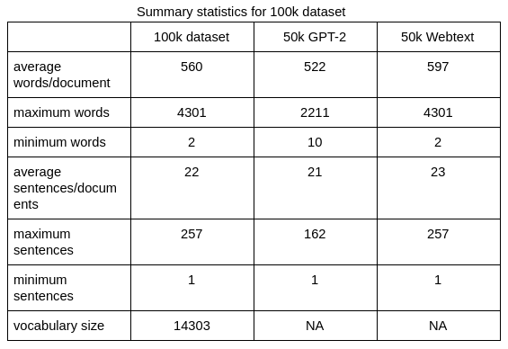

- We used the same procedure described above to process a 1k dataset (500 from Webtext and 500 from GPT-2). The purpose of this subset is to make sure our code runs error-free. The final results will be based on the 20k test set. 

## Engineering

- We are using a GPU provided by Google Colab. 
- In case we encounter an out-of-RAM issue when processing 100k documents, we will switch to TPU provided by Google Cloud. 

## Classifiers Used

- We have used three classifiers viz. Logistic Regression, CNN and BERT.

### Logistic Regression

- Motivation - OpenAI used LR as a baseline model so we decided to do the same. 
- Code - adapted directly from [OpenAI](https://github.com/openai/gpt-2-output-dataset/blob/master/baseline.py). We further tuned the hyperparameter “C” and determined the best C is 100.
- Tokenizer - no tokenizer used. Documents were vectorized using the following hyperparameters:
      `vect = TfidfVectorizer(ngram_range=(1, 2), min_df=5, max_features=2**21)`
      
### CNN

- Motivation - CNNs are very fast to train and the CNN tutorial conveniently provided a framework for binary text classification that we can adapt.
- Code - adapted directly from the [CNN tutorial](https://github.ubc.ca/MDS-CL-2019-20/COLX_585_trends_students/blob/master/labs/Lab1/cnn_text.ipynb).
- Tokenizer: spacy for english

##### Fine-tuning: The base CNN model performed so well that the hyperparameters we fine-tuned did not actually beat the baseline. Here is everything tried:
    - TEXT.build_vocab(min_freq=5) - vocabulary size shrunk from 145,529 (originally min_freq=2) to 78,406. This is an attempt at seeing if the model would perform better with more targeted, higher frequency vocabulary.
    - TEXT.build_vocab(min_freq=2, vectors = “glove.6B.300d”) We also tried pre-trained word embeddings and the performance was not bad, however it was a few points behind the baseline CNN, which sampled from a normal distribution for its initial embedding weights.
    - kernel_num = 10 - no improvement in performance so set back to 32.
    - batch_size = 32 - after reducing batch size, the model ran slower and performed worse.
    - drop_out = 0.7 - no improvement in performance, so set back to 0.5.
    - lr=0.01 - model was not learning and gave the same validation f-score after one epoch.
    - SGD optimizer(lr=0.0001, momentum=0.9, weight_decay=0.001) - model stopped learning and gave the same validation f-score after one epoch. 
    - SGD optimizer(lr=0.0001, momentum=0.5, weight_decay=0.01) - model improved with each epoch but performance was poor.

##### Best CNN model hyperparameters:
- vocabulary_size = 145549
- embedding_dim = 300
- kernel_sizes = [2,3,4]
- kernels_num = 32  
- dropout = 0.5
- output_size = 2
- lr = 0.0001
- epoch = 20

- Best CNN model with initial weights sampled from a normal distribution - 
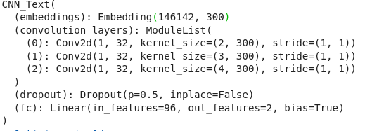
- Optimizer is Adam
- Loss function is CrossEntropyLoss

### BERT

- Motivation - BERT is the most cutting edge language model that we learned in class and we wanted hands-on experience with BERT.
- Code - we are using BertForSequenceClassification from the huggingface pytorch implementation[source](https://huggingface.co/transformers/v2.2.0/model_doc/bert.html#bertforsequenceclassification).
- Model - BertForSequenceClassification, which is a normal base model with an additional linear layer on top for classification that we used as a sentence classifier. The pretrained BERT model we used in this task was BERT-base-uncased, which is a variant of BERT with 12-layer, 768-hidden, 12-heads and 110M-parameters. It is pre-trained on lower-cased English text only. The BERT-based-uncased is a model identifier in Transformers so the vocabulary will be downloaded and applied to our tokenizer. 
- The maximum sequence length allowed by BERT is 512. However, due to computational load, we decided to use the maximum length of 128, so we  truncated any documents that are longer than 128 (i.e., only the first 128 tokens). We suspected truncation might cause longer documents not represented optimally, which would result in our model underperforming.
- Best BERT model:
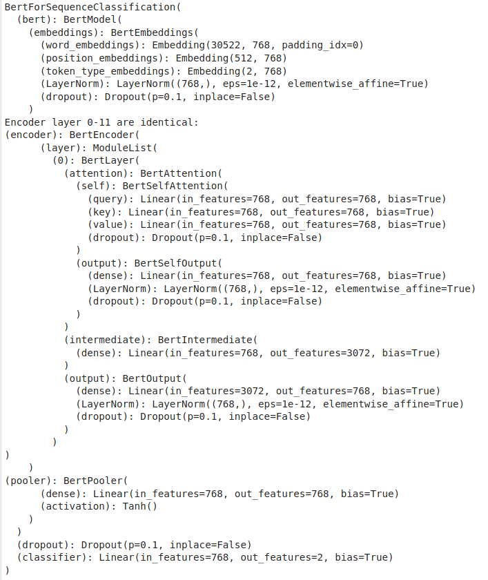

- The implementation of the BertPooler reveals that it is using the first hidden state, which corresponds to the [CLS] token. (https://github.com/huggingface/transformers/blob/master/src/transformers/modeling_bert.py#L426) 

## Challenges

- LR - since we simply used the code directly from OpenAI, we did not run into any challenges.
- CNN - the baseline CNN model was already performing so well that, unfortunately, the model did not improve with any fine-tuning attempts. The member in charge of the CNN was really sick for a week and sadly, by the time she was better, there was no time to revisit the code from [Understanding Convolutional Neural Networks for Text Classification](https://www.aclweb.org/anthology/W18-5408/). She moved on to the evaluations for the sake of time. 
- BERT - we used BertViz for visualization to overcome the challenge from last week where we had trouble visualizing the attention weights. With this new method, we encountered two new challenges. First, BERT was fine-tuned on a maximum sequence length of 128 tokens, but every time we tried to run BertViz on documents of 128 tokens, colab automatically disconnected. We then tried chunking documents into 64 tokens, which finally yielded visualizations. Below is the graph BertViz returned (the entire plot cannot be displayed on the screen): 

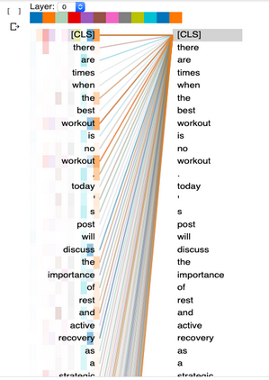

- Our second challenge is knowing how to interpret BertViz. Since this is a binary classification task, we are mostly interested in the attention weights relative to the first token, [CLS]. The darker lines indicate that the attention weights from these tokens were higher (closer to 1?) than the rest of tokens, but we are still unsure what this means. Please give us some guidance on interpreting the visualization. 

## Previous Works

### Human and Automatic Detection of Generated Text (https://arxiv.org/pdf/1911.00650.pdf) (2019)

The authors examined how choices can impact the performance of models to automatically detect machine-generated text as well as the performance of human raters. The authors trained both simple discriminators and deep neural network models, such as BERT, on balanced binary classification datasets. They found fine-tuned BERT discriminators performed significantly better than the simple discriminators. As a follow up investigation, they compared the performance of auto-discriminators and human raters, and found that all discriminators performed better than human raters, especially documents that are from the same domain as the training data. Interestingly, the auto-discriminators performed much worse on the out-of-domain samples. Therefore, they concluded that in addition to the generative model considered, sampling method is important  in training effective automated discriminators. Cross-domain training samples may help to yield a stronger discriminator. Of the sampling method they used in the study, top-k 40 was consistently more difficult for human raters to identify (while auto-discriminators did better on detect samples generated by top-k 40). The authors addressed that the current methodology for text generation can well resemble human-written texts, and they concluded that it is possible to generate texts that are hard for humans and machines to detect.

### GLTR: Statistical Detection and Visualization of Generated Text](https://www.aclweb.org/anthology/P19-3019.pdf) (2019)

The authors developed a statically based model, GLTR (pronounced glitter, short for Giant Language Model Test Room) to help humans detect fake text. BERT and GPT-2 117M are the models behind GLTR. They found that language models tend to overgenerate from a subset of words where the models are confident about its distribution. This results in a sampling pattern that is distinct from human generated text. GLTR uses three tests to uncover the sampling distribution of written text: (1) probability of the word; (2) absolute rank of a word; (3) entropy of the predicted distribution. GLTR has the ability to visualize its findings.
The authors found that fake text tends to use more high probability words, low rank words and there is low entropy. In contrast, human generated text uses words with lower probability and words with higher rank even if there is high entropy. Qualitatively, unlike human generated text, fake text does not follow the theory of centering, use fewer synonyms and referring expressions. 

### Release strategies and social impact of language models (https://arxiv.org/pdf/1908.09203.pdf) (2019)

This OpenAI report discusses the social impact of generative models like GPT-2 and how the task of detecting synthetic text from human generated text is vital and calls for social awareness.

Research carried out by Cornell University has found that fake news samples cherry picked from the 355 million parameter GPT-2 model were considered “credible” by human readers almost 66% of the time. The percentage kept increasing as more parameters were added to the model being considered.This poses a real threat to society as the techniques and models in place currently to help detect synthetic text will be essentially tools used to evaluate the upcoming GPT-2 models. 

In the study conducted by Cornell they investigated the underlying factors that made synthetic text seem believable to people, but they noticed that even participants who could notice inaccuracies still cited the story’s plausibility as their basis for the assigned credibility score.

The authors classified automated-ML based detection into 3 categories: 1) simple classifiers, 2) zero-shot detection, 3) fine tuning based detection.

The authors also reported on the benefits of using RoBERTa for classification. Since it is a discriminative model, it has a different architecture and uses different tokenizers than GPT-2, thus achieving an accuracy of 95% when trained on data generated from the 1.5 billion parameters GPT-2 model.

## Evaluation and Visualization
Baseline results on Train and Validation sets:

| Model  |Train loss|Val loss|Val accuracy| F1    |
|---|---|---|-----|-----|
| LR  | n/a  |n/a | 87.01  |     |
| CNN  |0.3497   |0.4854   | 81.25    |80.95    |
| BERT  | 0.0475  | 0.3874  | 91.46    |91.42    |

Final results on the Test set:
### Logistic Regression
- F-score is 88.23%.

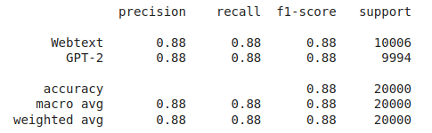

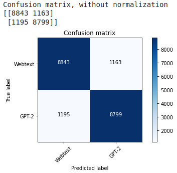

From the above confusion matrix we can see that logistic regression did a good job overall to classify the GPT2 generated text from the human generated webtext data.

The True positives and True Negatives are both high and the numbers are pretty close to each other (8843 and 8799)

The False Positive and False Negative numbers are also about the same.

But overall we can see that the model performs better in classifying GPT2 text rather than human generated WebText data.

### CNN
The best CNN model predicted about 80% of the data correctly (16,142/20,000). In terms of error, the model had difficulty correctly detecting GPT-2 generated text. Actually, 82% of the wrong predictions were categorizing GPT-2 text as Webtext (3,170/3,858). As previous research pointed out, short synthetic text is harder to detect. This is true for the CNN model, which is discussed in more detail in the next section.

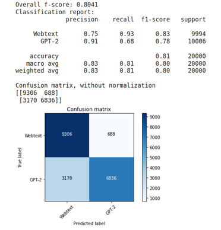

### BERT

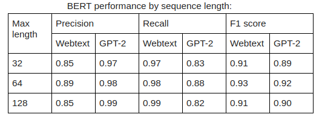

We hypothesized that fine-tuning BERT on training data with different sequence lengths might yield different results. The table above showed that our model performed consistently well across all sequence lengths. It may be because our train, validation and test set were from the same two sources, Webtext and GPT-2, hence our model learned to detect even the  shorter sequences. However, training BERT on longer sentences made the model more prone to overfitting. The model trained on sequences of length 128 overfitted on the training data after the first epoch whereas the model trained on sequences of length 32 did not overfit until epoch 3.
 
Training results on the BERT classifier with maximum length = 128

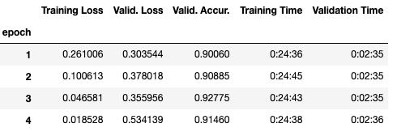

Looking at the training statistics, although the validation accuracy increased a little bit in the later epochs, the model seriously over-fitted on the training data. Therefore, we chose to use the model from the first epoch which showed minimal overfitting.
 
Below is the classification report and the confusion matrix from the best BERT classifier.

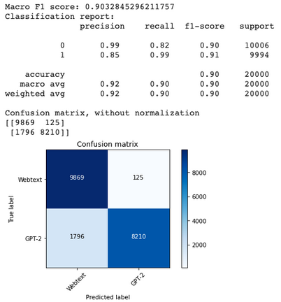

The best BERT model did very well on the test set compared to the LR and CNN. It predicted about 90% of the data correctly (18,079/20,000). In terms of error, the BERT model showed the same problem that CNN had: it had trouble correctly labeling GPT-2. It incorrectly categorized 1796 GTP-2 text as Webtext, which is 93% of the errors (1,796/1,921).

The cause of the model mislabelling GPT-2 text may be because:
- GTP-2 did a good job in generating texts that are truly human-like.
- Since we truncated the documents to a maximum of 128 tokens, the model was unable to learn from a full set of data, affecting its performance. 
- As previous research mentioned, shorter sentences are harder to classify.

## Model interpretation

### Logistic Regression

To evaluate the performance of the model, we randomly picked two sample blogs from the GPT-2 test set and 2 samples from the Webtext test set. 
The results are as follows:

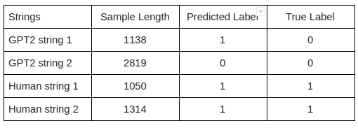

Thus overall we see that the model faced some difficulty in giving the correct classification when the sample length was shorter.
The actual strings can be found in Appendix C.

### CNN

The model had difficulty correctly labeling GPT-2 data. Therefore, we selected two of the shortest GPT-2 documents and two of the longest GPT-2 documents from the validity dataset for the model to make predictions. See Appendix A for the GPT-2 strings. Unsurprisingly, the model correctly predicted the longer sentences but not the shorter sentences. 

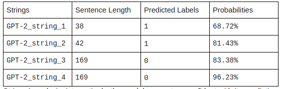

- String_1 analysis: interestingly, the model was not as confident with its prediction for this string compared to the other short string. We tried changing the string in different ways to see how it would affect the model. We managed to increase the model's prediction probability to 74% by making the sentence a bit more fluent by adding one "the" and removing a repeated word, replacing the second "structure" with "makeup". See the changes in String_5 in the Appendix. We also experimented with the punctuations, removed the date, but found that they did not make a difference. The biggest gain in probability comes from removing the repeated word, hinting that repetition is a feature for synthetic text detection.
- String_3 analysis: having established that repeated words appear to be an indicator for synthetic text detection for a CNN model, this string actually has and a few repeated sentences. Hence, the model confidently predicted it is GPT-2 generated. We removed the repetition in string_6 (see Appendix), which also shortened the sentence, and the model then made the wrong prediction, thinking the string_6 is human-generated.
- String_4 analysis: Perhaps the model correctly predicted this document because the writing is unnatural. Even though the writing is grammatical, phrases like “the mechanic is in the message” does not make sense. We tried using this example to see how short it needed to be for the model to make a wrong prediction. We simply deleted one sentence at a time to see how the CNN responded and we were surprised to find we had to truncate the document to one sentence (i.e., 28 words long) in order to fool the model (see string_7 in the Appendix). There are definitely certain features in this particular document that makes the model very confident it is fake text.

### BERT

To compare BERT with CNN, we used BERT to predict the same sentences. The results are as follows.
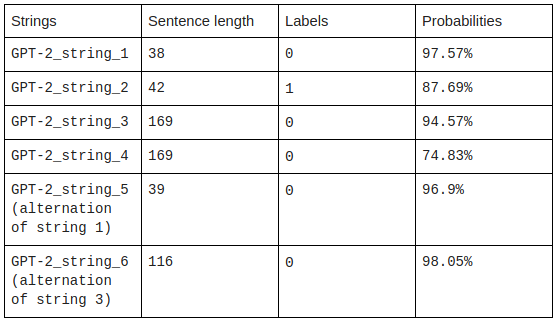

- BERT did a very good job at classifying GTP-2 generated text. Compared to the CNN model, whose performance was influenced by sentence length, the BERT model did well while classifying shorter sentences (string_1 and 2). 
- String_1 and string_5 analysis: by altering string_1 to make it more fluent and resemble human-generated text better, the predictions and the probabilities did not change a lot. Both string_1 and 5 were predicted as GTP-2 generated text with a very minor drop in the probabilities, from 97.57% to 96.9%.
- String_3 and string_6 analysis: by removing the repetitive words in string_3 to the form string_6, the probability of it being a GTP-2 generated text increased. This probably means BERT did not consider repetition as an important feature for GPT-2 generated texts. 
- The confusion matrix revealed that the model had difficulty correctly labeling GPT-2 data. Since we suspect that sequence length may influence the performance of our models, we selected those incorrectly predicted documents and created two histograms to see how this feature affects predictions. In the following histogram, “0” means the documents are GTP-2 generated but our model incorrectly predicted them as human-generated, and “1” means the documents are from Webtext but our model incorrectly predicted them as GTP-2 generated. The x-axis is the actual count of tokens in the document, not just the 128 tokens that BERT was trained on. 

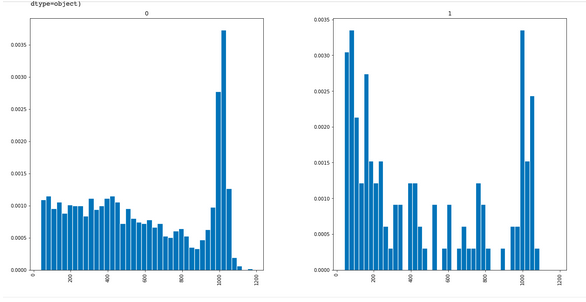

Two major observations from the histograms:
- The shorter Webtext documents were more prone to wrong predictions than GPT-2 data. The number of wrong predictions for GPT-2 data dropped from the minimum tokens (less than 100) to about 800 tokens, but the drop is gradual, unlike Webtext’s histogram. 
- At around 1000 tokens, there is a spike in wrong predictions for both sources. We think that truncating documents to 128 tokens adversely affected BERT’s performance when the actual document was 1000 tokens long. Sequence length might not have played a significant role in fooling our BERT model, rather it is the fact that we were unable to feed all the information to BERT that hindered its performance. 
- We plan to use BertViz to do the visualization on multi-head attentions. The sample multi-head attention visualization is in the Appendix B, but we have trouble interpreting it.

## Conclusion

- Out of the three classifiers we trained, BERT is certainly superior in fake text detection, followed by Logistic Regression and finally the CNN. BERT also took the longest to train on truncated text, which was an hour compared to mere minutes for the other two models. 
- Future directions: there are a lot of other models that we could have tried like fastText, RoBERTa, GLTR and even GPT-2 itself. [OpenAI](https://arxiv.org/pdf/1908.09203.pdf) reported that RoBERTa achieved about 95% accuracy and performed better than generative models. With only 100k documents truncated to 128 tokens per document, would RoBERTa beat our BERT? With more time and resources, it would be interesting to see if any of these models perform better than our BERT. 

## Appendix A

### CNN & BERT Evaluation Sentences

- GPT-2_string_1 is 38 words long.
The text: "Scientists can now visualize and experiment with structures and dynamics of complex molecular structures (at atomic-level precision), with real-time multi-user collaboration via the cloud

July 6, 2018"
The prediction for GPT-2_string_1 is 1 and the model was 0.6872% confident.

- GPT-2_string_2 is 42 words long.
The text: "Pro Tour Amonkhet is now down to just eight players. Take a look at what they brought for this weekend's Standard rounds, and what they will be battling with on Sunday for the title of Pro Tour Champion."
The prediction for GPT-2_string_2 is 1 and the model was 0.8143% confident.

- GPT-2_string_3 is 169 words long.
The text: "Summary Focus of this page: This page discusses our current view of the evidence for a wide range of programs and interventions that aim to improve education in developing countries. These include demand-side interventions that lower the cost of schooling or increase its (perceived) returns, provision of school inputs, pedagogy interventions, and governance reforms. We focus mainly on interventions aimed at improving primary and secondary education but consider vocational training interventions briefly. We have not yet completed a report on early childhood (pre-school) interventions. On this page, we focus on evidence from experimental study designs.\n\nThis page discusses our current view of the evidence for a wide range of programs and interventions that aim to improve education in developing countries. These include demand-side interventions that lower the cost of schooling or increase its (perceived) returns, provision of school inputs, pedagogy interventions, and governance re..."
The prediction for GPT-2_string_3 is 0 and the model was 0.8338% confident.

- GPT-2_string_4 is 169 words long.
The text: "If you look on a board game shelf, how many games will you see with actions based on collaboration, stewardship, generosity, and gratitude? Most likely, you'll find mechanics like attacking, stealing, and backstabbing. Indigenous communities looking to facilitate intergenerational gameplay are thus hard-pressed to find options that reinforce their teachings. In response, communities are developing their own games for passing on teachings in many forms. As espoused by game designer Brenda Romero, the mechanic is the message. And the messages in the board game The Gift of Food—inspired by collaborative game development with Indigenous communities working with the Northwest Indian College—produce culturally responsive gameplay, meaning gameplay that is drawn from and that uplifts the cultures involved.\n\nThe Gift of Food is an ideal example of how culturally responsive board games can function as important pathways for passing on Indigenous ways of knowing, as learning and reinforcin..."
The prediction for GPT-2_string_4 is 0 and the model was 0.9623% confident.

- GPT-2_string_5 is 39 words long.
The text: "Scientists can now visualize and experiment with structures and the dynamics of complex molecular makeup (at atomic-level precision), with real-time multi-user collaboration via the cloud

July 6, 2018"
The prediction for GPT-2_string_5 is 1 and the model was 0.7422% confident.

- GPT-2_string_6 is 113 words long.
The text: "Summary Focus of this page: This page discusses our current view of the evidence for a wide range of programs and interventions that aim to improve education in developing countries. These include demand-side interventions that lower the cost of schooling or increase its (perceived) returns, provision of school inputs, pedagogy interventions, and governance reforms. We focus mainly on interventions aimed at improving primary and secondary education but consider vocational training interventions briefly. We have not yet completed a report on early childhood (pre-school) interventions. On this page, we focus on evidence from experimental study designs."
The prediction for GPT-2_string_6 is 1 and the model was 0.6829% confident.

- GPT-2_string_7 is 28 words long.
The text: "If you look on a board game shelf, how many games will you see with actions based on collaboration, stewardship, generosity, and gratitude?"
The prediction for GPT-2_string_7 is 1 and the model was 0.6283% confident.

## Appendix B

### BERT Multi-head Attention Visualizations

Sentence 1: our BERT model incorrectly predicted this GPT-2 generated texts as webtext/human-generated.

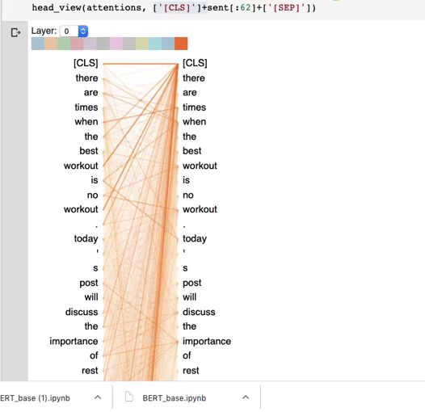

Sentence 2: BERT incorrectly predicted this GPT-2 generated sentence as human-generated

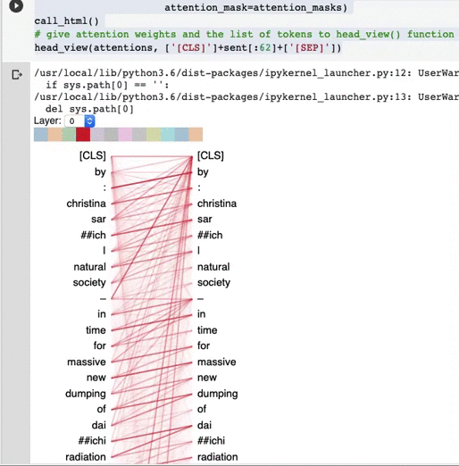

Sentence 3: This sentence is from webtext but our model incorrectly predicted it as GPT-2 generated
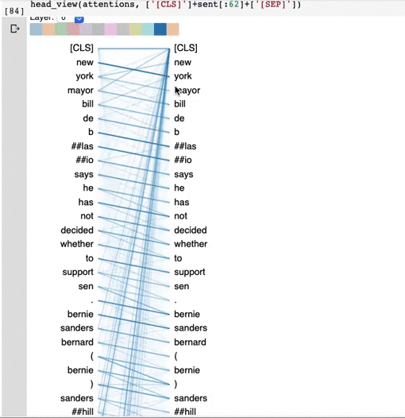

Sentence 4 : BERT incorrectly predicted this human-generated sentence as a GPT-2 generated text
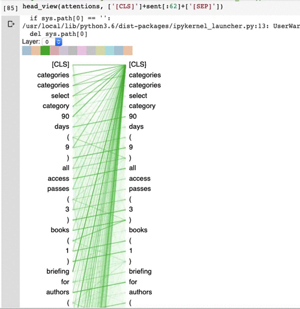

## Appendix C

### Strings used for Logistic Regression evaluation

- GPT2_string1 
"It seems as though T-Mobile is experiencing some network issues today. My first experience of it – coincidentally enough – was while being guest host on PocketNow's weekly podcast a short while ago. Since then, I've had a number of emails and tweets informing me that it's not just isolated to the Boston area where the show was being hosted.\n\nChecking DownDetector makes it clear that there are several reports of outages in a number of areas across the U.S. Areas mentioned specifically include New York, Brooklyn, Philadelphia, Washington D.C., Boston, Bronx, Providence, Baltimore, Jersey City, and Somerville.\n\nIt's unusual to see such a widespread outage as this one, so be sure to let us know where you are, and if you've experienced your LTE dropping out.\n\nUPDATE #1: John Legere has tweeted, acknowledging the outage in the North East\n\nThanks for making sure we're aware of some network issues in the NE. The network team is on it. I'll let u know when fully restored. — John Legere (@JohnLegere) February 13, 2015\n\nUPDATE #2: Should be back up and running now. Reboot your device if you were affected and see if it has improved."

- GPT2_string2

MUMBAI: India\'s star professional boxer and Olympic bronze medalist Vijender Singh will clash with China\'s undefeated, left-handed fighter Zulpikar Maimaitiali for a double title fight here on August 5.Vijender, who is WBO Asia Pacific Middleweight champion, will take on Zulpikar, the WBO Oriental Super Middleweight champion, at the NSCI Stadium in Worli, it was announced at a media conference on Tuesday, in the presence of the Indian boxing star.Vijender, the Beijing Olympics bronze medallist, has been training in Manchester, England, with his trainer Lee Beard for the bout, the first ticket of which was presented to cricket icon Sachin Tendulkar at the latter\'s house by the boxer himself.In this fight, the two boxers will put their respective WBO titles at stake and whoever wins the bout will take home his defended title along with his opponent\'s too, it was announced.Three other Indian pugilists Akhil Kumar, Jitender Kumar and Neeraj Gayat will be seen in the ring, taking on international opponents, whose names will be declared later, on the fight day and it will be 2006 Melbourne Commonwealth Games gold medalist Akhil\'s debut bout as a pro.Apart from them, three other Indian boxers - Pardeep Kharera, Dharmender Grewal and Kuldeep Dhanda - will also take on international boxers, whose names will be announced on the fight day."I am all set for the August 5 bout. He (Zulpikar) is just a young kid, a southpaw. When he said that he will knock me out, I was laughing. We will show China that we are the best," the 31-year-old Vijender said at the media conference."My training is in great shape. I will again go to Manchester tomorrow and start my training. I will come here (to Mumbai) a week before the fight," the pugilist added.Fight organisers, IOS Boxing Promotions , said they had initially planned the fight in March-April, but it did not happen.Zulpikar expressed confidence of winning against the Indian boxing star, saying he will knock Vijender down.He has eight bouts against his name, the same as Vijender.Zulpikar has scored five knock-outs wins and has fought 24 rounds. His last bout was with African boxer Thomas Mashali after which he won his current title of WBO Oriental Super Middleweight Champion last year. He turned towards pro in April 2015.Vijender, who has remained unbeaten since his debut in professional boxing in 2015, has fought eight bouts with the last one being against former world number 1 boxer Francis Cheka from Tanzania, whom he defended for his title.Vijender clinched on to his first title, in July 2016, against Kerry Hope of Australia, becoming the WBO Asia Pacific Super Middleweight Champion.Overall, Vijender has fought eight bouts with seven of them being won by knock-out. He has 30 rounds under his belt, eight more than his opponent from China.'

- human_string1

LONDON: British Prime Minister Theresa May is expected to announce a dramatic shift in the way the UK runs its health services before next week.\n\nMrs May is expected to announce that the NHS would be given permission to make "more radical" cuts than was previously planned in the budget unveiled in March. Such moves are aimed at freeing up funds to fund things like the Government\'s controversial so-called "snooper\'s charter", which would force internet firms such as Facebook and Twitter to hand over user data to the police and security services.\n\nA spokeswoman for the Office for Budget Responsibility has said the changes are "not expected to materially change public finances". "However, they could have an impact on the public finances since they would need to be financed from other areas."\n\nThe cuts, which are expected to be announced by the Prime Minister during a visit to Japan this week, will be designed to ensure that the NHS does not get "squeezed" to the brink and that the health system is adequately funded, the spokeswoman said.'

- human_string2

This pattern is available\n\nThe pattern is free for your own personal use. You may sell any finished product or distribute this pattern; however, please provide a link to my blog at www.tiffanyshennams.com when making items for the pattern sale. Thank you!\n\nThis super soft, high-quality, 100% Merino-blend yarn creates a warm and comfortable sweater perfect for the cold winter months! The design is the quintessential modern twist on an existing classic!\n\nFinished size: Approximately 26 inches around when done with 3 color, 17 inches around when done with 2 color. A small swatch is included, with both the 3 color version and the 2 color version.\n\nPlease note this item is intended to be crocheted within the US.\n\nTo use the stitch pattern, simply insert your crochet hook into the stitch indicated by the symbol and then wrap yarn around a stitch. This creates a loop. The crochet hook, yarn and loop are then attached to each other by working through the loops. The loops are worked through until the stitch is complete. The length you work the piece in depends on your crochet tension. Once you know how long to make your piece without unraveling, start crocheting around to the size you desire!\n\nIf the pattern includes tips to help you crochet the correct gauge, please let me know and I can include them!'

      
      
      

